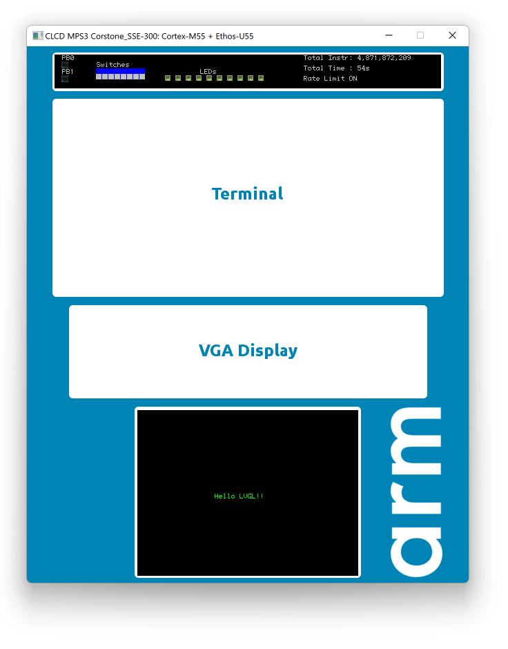
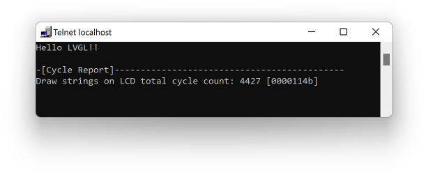

# lv_port_mps3_an547_cm55
A LVGL porting for Cortex-M55 running on an [Arm official FPGA prototyping development board](https://developer.arm.com/tools-and-software/development-boards/fpga-prototyping-boards/mps3) called MPS3 ([AN547](https://developer.arm.com/tools-and-software/development-boards/fpga-prototyping-boards/download-fpga-images#)), see **Figure 1**. It is also possible to run the project template on an emulator called [Corstone-300-FVP](https://developer.arm.com/tools-and-software/open-source-software/arm-platforms-software/arm-ecosystem-fvps), which is free.


**Figure 1 Arm MPS3 FPGA prototyping board** 

 


## Features

- LVGL 8.1.x  (CMSIS-Pack)
- 320 * 240 RGB565 LCD Display connected with an Integrated Color LCD parallel interface. 
- Default System Clock: 32MHz (50MHz Max)
- CPU: Cortex-M55 with Helium
  - DCache
  - ICache
  - ITCM: 512KB
  - DTCM: 512KB
- NPU: Ethos-U55
- PRAM (Used for Code and RO-Data): 2MByte
- SRAM: 4MByte
- DDR4: 1GByte
- MDK Project with Arm Compiler 6


## LVGL Porting Exercise 

For people to learn and practice how to port LVGL to a LCD-Ready MDK project using LVGL cmsis-pack, a dedicated branch called "***lvgl_porting_exercise***" has been introduced. It contains a clean project which provides:

- Low-level LCD APIs

```c
extern int32_t  GLCD_Initialize          (void);
extern int32_t  GLCD_Uninitialize        (void);
extern int32_t  GLCD_SetForegroundColor  (uint32_t color);
extern int32_t  GLCD_SetBackgroundColor  (uint32_t color);
extern int32_t  GLCD_ClearScreen         (void);
extern int32_t  GLCD_SetFont             (GLCD_FONT *font);
extern int32_t  GLCD_DrawPixel           (uint32_t x, uint32_t y);
extern int32_t  GLCD_DrawHLine           (uint32_t x, uint32_t y, uint32_t length);
extern int32_t  GLCD_DrawVLine           (uint32_t x, uint32_t y, uint32_t length);
extern int32_t  GLCD_DrawRectangle       (uint32_t x, uint32_t y, uint32_t width, uint32_t height);
extern int32_t  GLCD_DrawChar            (uint32_t x, uint32_t y, int32_t  ch);
extern int32_t  GLCD_DrawString          (uint32_t x, uint32_t y, const char *str);
extern int32_t  GLCD_DrawBitmap          (uint32_t x, uint32_t y, 
                                          uint32_t width, uint32_t height, const uint8_t *bitmap);
```


- A simple ***main()*** function

- A simple way to display string on LCD

```c
extern 
int32_t GLCD_DrawString(uint32_t x, uint32_t y, const char *str);

#define __LL_LCD_PRINT_BANNER(__STR)                                            \
        do {                                                                    \
            GLCD_DrawString(    (GLCD_HEIGHT) / 2 - 8,                          \
                                (GLCD_WIDTH - sizeof(__STR) * 6) / 2,           \
                                __STR);                                         \
        } while(0)
```


- **printf()** is retargeted to USART0 (telnet in FVP emulation).
- A function, ***GLCD_DrawBitmap()***,  for flushing display buffer to LCD, which supports window-mode (partial flush).

```c
extern 
int32_t  GLCD_DrawBitmap (uint32_t x, uint32_t y, 
                          uint32_t width, uint32_t height, 
                          const uint8_t *bitmap);
```

- Ready to Compile and Debug in FVP (Emulation) as shown in Figure 2.


**Figure 2 A Clean Project Template for practicing LVGL Porting using LVGL CMSIS-Pack** 

 

- A new method, ***\_\_cycleof\_\_()***, for measuring cpu cycles consumed by specified code segment.

```c
    __cycleof__("Draw strings on LCD") {
        __LL_LCD_PRINT_BANNER("Hello LVGL!!");
    }
```


**Figure 3 *printf()* and *\_\_cycleof\_\_***

 

## License

- LVGL used in this project is under MIT license.
- This project template is under Apache 2.0 license.


## Reference

1. [Arm Corstone SSE-300 with Cortex-M55 and Ethos-U55 Example Subsystem for MPS3](https://developer.arm.com/documentation/dai0547/c?_ga=2.157798205.688811587.1624957483-616249991.1623083451)


